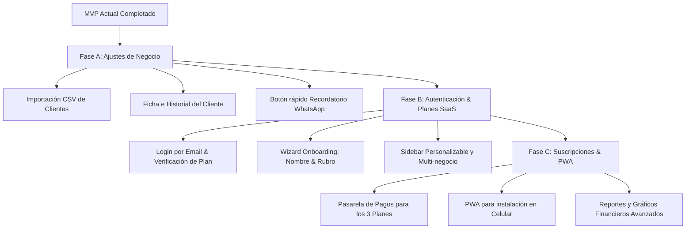

# Roadmap y Pendientes para el Estado Final de L&T Manager

Este documento analiza las funcionalidades expresadas en el `PROJECT_BRIEF.md` que aún restan implementar, junto con las mejoras técnicas y de producto necesarias para evolucionar el MVP actual hacia una versión final comercializable como **SaaS Multi-tenant**.

---

## 📋 1. Funcionalidades Pendientes del Brief del Proyecto

### 🔹 Importación Fácil de Clientes (Sección 3 & 5 del Brief)
* **Estado actual:** Alta y edición manual cliente por cliente.
* **Falta implementar:**
  - Módulo de importación masiva desde un archivo **CSV / Excel** o pegado rápido de texto (ej. nombres y teléfonos copiados de WhatsApp).
  - Parser inteligente que limpie prefijos telefónicos (+54, 9, etc.) para normalizar la agenda.

### 🔹 Ficha e Historial Completo por Cliente (Sección 3 del Brief)
* **Estado actual:** En la lista de clientes se muestra el contador total de turnos.
* **Falta implementar:**
  - Vista/Modal de **Ficha de Cliente** individual.
  - Timeline cronológico con turnos pasados, servicios consumidos, fechas de atención y total acumulado gastado por el cliente.
  - Notas o preferencias del cliente (ej: *"Prefiere corte a tijera"*, *"Alérgico a X producto"*).

### 🔹 Gestión de Productos Físicos (Sección 3 del Brief)
* **Estado actual:** Gestión enfocada 100% en servicios.
* **Falta implementar:**
  - Tabla y módulo de **Productos** (ej. cera de peinado, aceites de barba, suplementos).
  - Venta directa de productos al momento de cobrar un turno o de forma independiente.

---

## 🚀 2. Autenticación, Onboarding y Personalización SaaS

### 🔐 1. Registro, Login por Email y Verificación de Plan
- **Registro & Login por Email:** Autenticación por correo electrónico con sistema de verificación (Magic Link o código enviado por mail).
- **Control de Plan de Pago:** Identificación en tiempo real del plan activo del usuario (Plan Inicial, Pyme o Empresa) mediante el estado de su cuenta.
- **Aislamiento de Datos (`tenantId`):** Multi-tenancy estricto donde cada usuario autenticado accede de forma aislada a los datos de sus propios negocios.

### 2. Onboarding Inicial del SaaS
Al abrir la aplicación por primera vez tras crear una cuenta, se despliega un flujo guiado simplificado:
1. **Creación del Negocio:** Ingreso del nombre del negocio y logo.
2. **Selección del Rubro:** Elección del tipo de negocio (Barbería, Centro de Estética, Gimnasio, Comercio/Supermercado, etc.).
3. **Preset de Funciones:** Según el rubro elegido, el sistema preconfigura automáticamente los módulos iniciales (ej. Barbería habilita Turnos+Servicios; Comercio habilita Productos+Cobros rápidos).

### ⚙️ 3. Personalización Modular del Sidebar y Funciones
- **Configuración de Módulos:** En los ajustes del perfil/negocio, el usuario tiene la posibilidad de activar o desmarcar secciones del Sidebar (ej: ocultar *Servicios* si solo vende productos, o activar *Turnos* si decide incorporarlos después).
- **SaaS Adaptable:** Permite que la plataforma se amolde exactamente a la forma de trabajar de cada cliente sin sobrecargar la interfaz con opciones que no necesita.

---

## 💎 3. Estructura de Planes de Suscripción y Límites

A continuación se detalla la estructura comercial dividida en **3 niveles de planes**, adaptada al crecimiento de cada cliente:

### 🟢 1. Plan Inicial (Starter)
- **Uso ideal:** Pequeños emprendimientos, profesionales independientes o negocios que están empezando.
- **Límite de Negocios / Sucursales:** Permite crear y administrar **1 solo negocio** en la interfaz.
- **Límite de Turnos:** Hasta 50 turnos por mes.
- **Límite de Clientes:** Hasta 100 clientes registrados.
- **Personalización del Sidebar:** Menú estándar preconfigurado según el rubro elegido.
- **Recordatorios por WhatsApp:** Enlaces manuales sencillos.
- **Usuarios y Empleados:** 1 usuario (dueño).
- **Reportes:** Resumen básico en pantalla (sin exportación masiva a PDF/Excel).

### 🔵 2. Plan Pyme (Profesional)
- **Uso ideal:** Negocios consolidados que necesitan administrar más de un local o tienen mayor volumen.
- **Límite de Negocios / Sucursales:** Permite crear y alternar **hasta 3 negocios / sucursales** desde el menú de inicio.
- **Límite de Turnos:** Hasta 500 turnos mensuales por negocio.
- **Límite de Clientes:** Clientes e historial ilimitados.
- **Personalización del Sidebar:** **Totalmente personalizable** (el usuario puede marcar/desmarcar qué secciones quiere visibles en su barra lateral).
- **Recordatorios por WhatsApp:** Accesos rápidos inteligibles (`wa.me`) con plantillas configurables.
- **Usuarios y Empleados:** Hasta 3 empleados o colaboradores por negocio.
- **Reportes y Exportación:** Exportación de listados a PDF / Excel + reportes financieros intermedios.

### 🟣 3. Plan Empresa (Growth / Enterprise)
- **Uso ideal:** Cadenas de locales, franquicias o empresas con alta demanda.
- **Límite de Negocios / Sucursales:** Permite crear y gestionar **hasta 100 negocios / sucursales** integrados en la misma cuenta.
- **Límite de Turnos:** **Turnos e ingresos ilimitados**.
- **Límite de Clientes:** Clientes e historial ilimitados.
- **Personalización del Sidebar:** Totalmente personalizable con perfiles específicos por sucursal.
- **Recordatorios por WhatsApp:** Envío de recordatorios **automáticos** vía API de WhatsApp.
- **Usuarios y Empleados:** Empleados y colaboradores ilimitados con roles de permisos avanzados.
- **Reportes y Exportación:** Analítica avanzada, gráficos de ventas, rendimiento por empleado y exportación contable completa.

---

## 🚀 4. Funcionalidades Post-MVP / Consolidación (Sección 3 & 5 del Brief)

### 💬 Integración y Recordatorios por WhatsApp
* **Fase inicial (Plan Pyme):**
  - Botón directo de **"Enviar recordatorio por WhatsApp"** que abra `https://wa.me/<telefono>?text=...` con mensaje preconfigurado.
* **Fase avanzada (Plan Empresa):**
  - Integración con API de WhatsApp (ej. Baileys / Meta Cloud API) para envío de recordatorios automáticos 2 horas antes del turno.

### 📊 Reportes y Estadísticas Avanzadas
* **Métricas clave (Plan Empresa):**
  - Gráficos de ingresos semanales / mensuales por método de pago (Efectivo vs Transferencia vs Tarjeta).
  - Top de servicios más solicitados y días/horarios de mayor demanda.
  - Tasa de ausentismo / turnos cancelados.

---

## 📱 5. Mejoras de UX/UI y Experiencia Móvil (PWA)

### 📲 Progressive Web App (PWA)
- Agregar `manifest.json` y Service Worker para que el dueño del negocio pueda **"Instalar como App"** en la pantalla de inicio de su celular (Android/iOS) sin depender de tiendas como Google Play o App Store.

### 🖨️ Exportación de Datos
- Botón para exportar listados (Clientes, Cobros del día/mes) a PDF o Excel para control contable rápido.

---

## 📌 Resumen del Plan de Trabajo para la Versión Final

