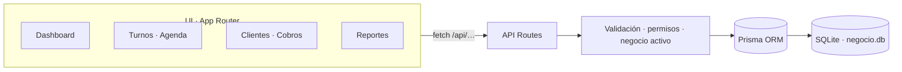

<div align="center">

# 🧠 L&T Manager

### Gestión simple para barberías, centros de estética y pequeños comercios.

**Ordena clientes, turnos, cobros, gastos, productos y caja sin reemplazar WhatsApp.**
La app trabaja *por detrás*: el negocio sigue hablando con sus clientes por WhatsApp y L&T Manager organiza todo lo demás.

[](.)
[](https://nodejs.org/)
[](https://nextjs.org/)
[](https://react.dev/)
[](https://www.prisma.io/)
[](https://www.sqlite.org/)
[](https://developer.mozilla.org/es/docs/Web/CSS)

**Hecho por el equipo de L&T Software** · Trabajo Práctico Integrador de Creación y Gestión de un Emprendimiento Informático

</div>

---

## ✨ ¿Qué es?

Un **SaaS de gestión para negocios chicos** (barberías, estética, gimnasios y comercios) que ya hoy:

- Guarda **clientes**, **servicios**, **turnos**, **cobros** y **historial** en un solo lugar ordenado.
- Hace la **agenda** visual por día, semana y por **profesional**, con bloqueos, lista de espera y turnos recurrentes.
- Suma **equipo con roles y permisos**, y **comisiones por empleado** calculadas al cobrar.
- Conecta con **WhatsApp** con enlaces pre-armados (confirmar, recordar, difundir) sin necesitar APIs de pago.

No intenta reemplazar WhatsApp: **sigue siendo el canal con el cliente**, L&T Manager ordena lo que ocurre detrás.

---

| Turnos · Agenda | Dashboard | Configuración |
| :---: | :---: | :---: |
| `docs/screenshots/agenda.png` | `docs/screenshots/dashboard.png` | `docs/screenshots/config.png` |

---

## 🧩 Módulos

| Módulo | Qué hace | Estado |
| --- | --- | :---: |
| **Dashboard** | Métricas en vivo, próximos turnos, alertas de deudores y stock bajo, guía de inicio | ✅ |
| **Turnos** | Agenda por día / semana / **visual por profesional**, bloqueos, lista de espera, **series recurrentes**, cobro rápido y estados (Pendiente · Completado · Cancelado · Debe) | ✅ |
| **Clientes** | Alta, edición, búsqueda instantánea, ficha con historial, etiquetas, cumpleaños e **importación pegando texto de WhatsApp** | ✅ |
| **Servicios** | Precios, duraciones y combos | ✅ |
| **Cobros / Ventas** | Cobro express vinculado al turno, propinas, descuentos, **deudores** y venta de productos con descuento de stock | ✅ |
| **Productos** | Inventario con stock mínimo y alertas de reposición | ✅ |
| **Gastos y Caja** | Egresos, apertura diaria y conteo real de caja | ✅ |
| **Reportes** | Ingresos y egresos, comparativos y **comisiones por profesional** | ✅ |
| **Mensajes** | Difusión por WhatsApp con enlaces `wa.me` listos | ✅ |
| **Equipo 🆕** | Miembros con rol (Dueño · Admin · Empleado), color y **% de comisión**, integrado en Configuración | ✅ |

---

## 🧱 Stack

<div align="center">

[](https://nextjs.org/)
[](https://react.dev/)
[](https://www.prisma.io/)
[](https://www.sqlite.org/)
[](https://developer.mozilla.org/es/docs/Web/CSS)
[](https://developer.mozilla.org/es/docs/Web/JavaScript)
[](https://git-scm.com/)

</div>

| Capa | Tecnología |
| --- | --- |
| Frontend + Backend | **Next.js 16** (App Router, API Routes) y **React 19** |
| Base de datos | **SQLite** embebida en `prisma/negocio.db` (migrable a PostgreSQL vía Prisma) |
| ORM | **Prisma 6** |
| Estilos | **Vanilla CSS** con design tokens propios, **mobile-first** |
| Estado / datos | Server Components + fetch a `/api/...` |
| Auth | Sesión propia con `bcryptjs` y `SESSION_SECRET` |

> **100% ejecutable en local**, sin servidores externos ni costos de hosting: ideal para desarrollo y validación previa al despliegue.

---

## 🏗️ Arquitectura



### 🔒 Multi-negocio y permisos

Cada cuenta puede tener **varios negocios** según su plan. Cada negocio tiene su propio rubro, configuración y sidebar, con **aislamiento total de datos** (`negocioId` como tenant en todas las consultas). Los **roles** (Dueño / Admin / Empleado) filtran módulos privados como Configuración, Gastos, Reportes y Compras tanto en la interfaz como en el backend.

---

## 🚀 Puesta en marcha

### Requisitos

- **Node.js 20** o superior
- **npm**

### Arrancar en 3 pasos

```bash
npm install
npm run db:push        # crea/actualiza la base de datos (prisma/negocio.db)
npm run dev            # → http://localhost:3000
```

### Datos de demo (opcional)

```bash
npm run seed
```

Entrá con la cuenta de demostración (plan **Empresa**, incluye equipo, comisiones, deudas y promos):

| Rol | Email | Password |
| --- | --- | --- |
| **Dueño** | `demo@ltmanager.com` | `demo1234` |
| Empleado | `juan@barberiademo.com` | `demo1234` |
| Empleado | `miguel@barberiademo.com` | `demo1234` |

---

## ⚙️ Configuración

Creá un archivo `.env.local` en `lt-manager-app/` para fijar el secreto de sesión:

```env
SESSION_SECRET=una-cadena-larga-y-aleatoria
```

| Variable | ¿Obligatoria? | Uso |
| --- | :---: | --- |
| `SESSION_SECRET` | En **producción** | Firma las sesiones. En desarrollo local usa un valor por defecto |

---

## 📜 Scripts

| Comando | Descripción |
| --- | --- |
| `npm run dev` | Servidor de desarrollo |
| `npm run build` | Build de producción |
| `npm run start` | Servidor de producción |
| `npm run lint` | ESLint |
| `npm run seed` | Carga la demo con datos de ejemplo |
| `npm run db:push` | Sincroniza el schema con la base de datos |
| `npm run db:generate` | Genera el cliente Prisma |

---

## 📁 Estructura del proyecto

```text
lt-manager-app/
├─ prisma/
│  ├─ schema.prisma        # modelos (usuarios, negocios, turnos, pagos, …
│  │                       #  + miembros, deudas, promos, gift cards, compras)
│  └─ seed.js              # demo re-ejecutable con datos de ejemplo
├─ src/
│  ├─ app/
│  │  ├─ (auth)/           # login · registro · menú de negocios
│  │  ├─ (negocio)/        # dashboard, turnos, clientes, cobros, …
│  │  └─ api/              # route handlers por módulo (aislamiento por negocio)
│  ├─ components/
│  │  ├─ ui/               # Button, Card, Input, Modal, PageHeader, …
│  │  ├─ agenda/           # AgendaTimeline (vista visual por profesional)
│  │  ├─ negocio/          # EquipoPanel
│  │  └─ layout/           # Sidebar dinámica por rol
│  └─ lib/                 # prisma, auth, permisos, validaciones, reportes
└─ public/                 # estáticos
```

Guía rápida para programadores (cómo arrancar y organizar el código): [`LEEME.md`](./LEEME.md).

---

## 🗺️ Roadmap

```text
MVP ✅                      →        V1 🚧            →      Growth
├─ Clientes                 →  Ficha completa del cliente  Recordatorios automáticos
├─ Servicios                →  Cuenta corriente/deudores   WhatsApp API
├─ Turnos · Agenda          →  Plantillas de Mensajes      Analítica avanzada
├─ Cobros · Caja            →  KPIs y comparativos         Multi-negocio completo
└─ Dashboard                →  Presupuestos · Recibo
                             →  Promos · Gift cards · Puntos
                             →  Compras · Proveedores
```

---

## 🤝 Contribuir

Proyecto educativo del equipo de **L&T Software**. Ideas, bugs y sugerencias son bienvenidas:

1. Hacé `fork` del repositorio.
2. Creá una rama: `git checkout -b feature/tu-idea`.
3. Corré `npm run lint` antes de enviar.
4. Enviá el Pull Request con una descripción clara del cambio.

---

## 📄 Licencia

© 2026 **L&T Software** — Todos los derechos reservados. Proyecto académico (TPI). El código fuente no está licenciado para uso comercial sin autorización previa.

---

<div align="center">

**L&T Manager** · Una forma más simple de administrar un negocio.

_Hecho con ❤️ y JavaScript, para negocios que trabajan todos los días._

</div>
